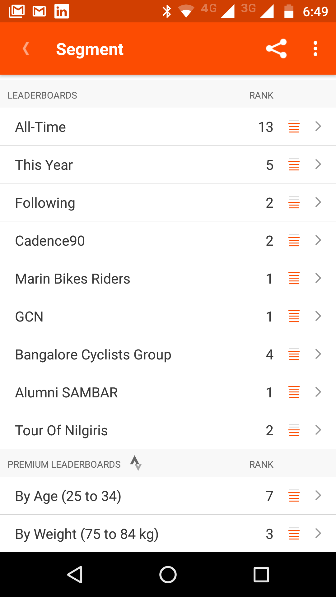

Walking was my first choice of activity to be fit until it became boring. I was doing 45 rounds in a park to finish 5KM walk. You can imagine how boring it can become after few days. Then I tried Gyms, after 10 days even that felt like I’m on a hamster wheel, BORING! After three years of thinking about it (because of high upfront cost), I finally decided to go for it. Thanks to a talk about cycling in [Barcamp Bangalore](https://barcampbangalore.org/bcb/) by Raison D’souza and my dear friend [Prashanth](http://payaniga.com/) for inspiring me. It’s been 1.5 months since I started and I have done 404 kms so far and I’m hooked! Here I list**5 reasons why I got hooked to Cycling** and why it can happen to you too:

## 1\. Keeps it fresh

Unlike other activities, Cycling keeps it fresh everyday. There’s always a new road you can take and explore. Walking/Running greatly reduces geographic range because of intensity. While in Cycling a 20km ride is no sweat and I’m saying that after just 1.5 months. Though I stuck to single known route for first month to build confidence, I have now started to explore. I follow a simple rule, go anywhere through any road, as soon as I hit 10–12 km, return, that makes it 20–25 km ride (thanks to Prashanth for this tip).

## 2\. Game mechanics makes it addictive

If you are not on Strava, you are not cycling! Strava is social networking for athletes but what’s more interesting is it’s game mechanics. With all the data tracked you are always competing, either with yourself or someone else. This gives a sense of progress/improvement everyday and you get addicted to it. Every time I finish my ride I spend at least 15 minutes looking at Strava, it’s so satisfying! “How I did in this segment”, “How my time compares to people I follow/people in clubs/etc”

## 3\. Meet new people

The first day I went on the ride, I was a bit nervous since this is all new to me. I saw another Cyclist on the other side of the road in opposite direction. I couldn’t wave since I was tightly holding the handle bar! When I came back home I was wondering if there’s a way to know who that was and connect. To my surprise Strava had exactly what I had imagined called “Strava Flyby”! I connected with him on Strava and after a month he happened to be on same path I was, we had a long conversation.

## 4\. Communities, Groups to ride along for long rides

There are many groups which are amateur friendly one of which is Cadence90 run by Chethan Ram (he also owns [Cycling Experience Store](http://www.cadence90.in/) by the same name where I bought my Cycle). When you get the hang of your bike, you would want to leave the city! But there will be some uncertainty running in the head doubting whether you can pull it off. Going in groups is great to break this mind barrier. Find a group in your city and ride with them when you are ready for it. Most groups are open and friendly.

## 5\. People around you will envy you

When I bought the bike, I was shying away from telling the price to anyone. I knew they would make fun of me, going by my historic failure in continuing any activity for more than 2 weeks. They expected to me to fail, but reverse happened and I had proof in Strava! When I say “I went on a 20km ride” on a weekday it surprises them. It may sound like nothing to fellow Cyclists but most people around me aren’t even walking a kilometer a day!

So that’s what is keeping me going and I hope to keep the tempo and do more mile crunching!
