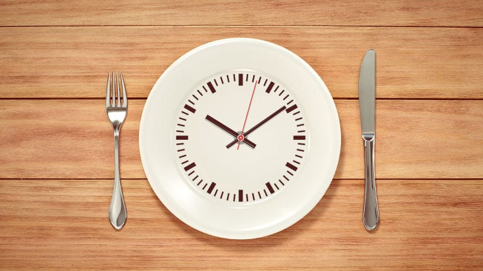

Before I get into what is Intermittent Fasting (IF), I must talk about other things I tried. I started digging into nutrition and metabolism after LIC rejected my policy because of ‘High Triglycerides’ (850+), basically one of the types of Cholesterol. I consulted a doctor and was prescribed ‘statin’, a drug which regulates cholesterol production. I was never a fan of drugs throughout my life, headache, fever etc I used to just suffer through it without medication. I wanted to take control of my Cholesterol levels without medication.

I was already into cycling by this time & started to up the frequency. Month after month I got my blood tested & the results didn’t change. I completely cut rice and wheat and switched to millets, Triglyceride in blood report remained at 850+. More research got me to know that Carbs (carbohydrates) are the culprits not the consumed fat! This was a big thing since it was exactly opposite of what we have been told, thanks to pharmaceutical companies, they just want us to keep buying their meds!

[Watch on YouTube →](https://www.youtube.com/watch?v=da1vvigy5tQ)

After I got to know that carbs are the biggest culprits, I started following LCHF diet (Low Carb High Fat) diet. But being a typical South Indian I couldn’t keep up with this diet. I came home tired from office and simply didn’t have the energy to explain a recipe to my mom or cook myself. I was almost concluding that taking medication might be the only option left for me and then I discovered this video on YouTube about Intermittent Fasting:

Unlike diets which one can’t keep doing and eventually give after few months, Intermittent Fasting (IF) is a lifestyle change. Fasting has tons of benefits, go through the above video to get an idea. To summarise:

- Increased insulin sensitivity
- Decrease in Triglycerides, Bad Cholesterol (LDL) and increase in Good Cholesterol (HDL)
- Increase in Growth Hormone Production
- Improved brain function
- Decrease in inflammatory markers
- And many more…

There are three regimes of Intermittent Fasting:

1. Alternate day fasting
2. 5:2 — Fast for two days in a week
3. 16:8 — Fast for 16 hour every day & eating window of 8 hours

**One Month of Intermittent Fasting**

I’ve been following the third method for a month now, it was hard for the first couple of weeks and then I got used to it. My eating window is normally between 1PM to 9PM and rest is my fasting window. So lunch is my first meal of the day and dinner is last & I skip breakfast. And no, breakfast isn’t the most important meal of the day! I have kept my diet the same which is normal South Indian high carb foods, which I’m not really proud of and will put in effort to switch to ‘high fat’. So the result: **My Triglyceride level is now down to 705**! Mind you, this is with just IF and not changing diet. I still have carbohydrate toxicity in my body because they constitute more than 90% of my diet!. My goal is now to slowly switch to fats and cut carbs and I will update this post with my progress.

Intermittent Fasting did in 30days what physical exercise, switching to millets couldn’t do for over 8 months! I’m sure I have found something which works to take control of my health.

Reference Book: [The Scientific Approach to Intermittent Fasting](https://www.amazon.in/gp/product/B01M13NXSV/ref=as_li_tl?ie=UTF8&camp=3638&creative=24630&creativeASIN=B01M13NXSV&linkCode=as2&tag=prashanthnet-21&linkId=06744fb8c901fb838be46acaea0bf78b)
