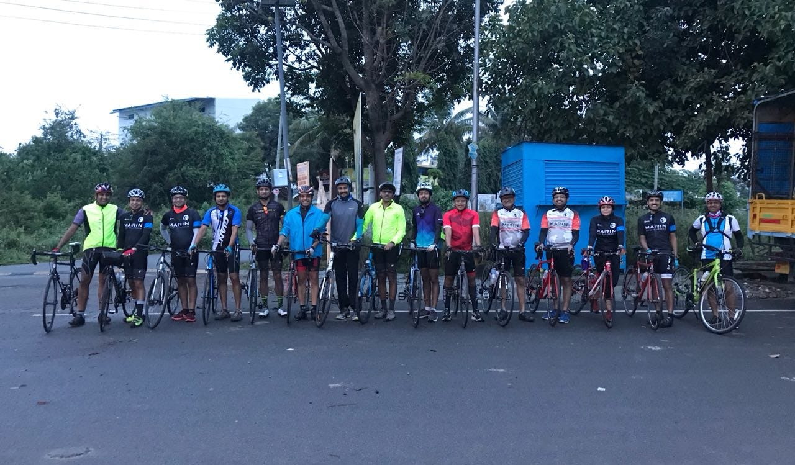

I had been completely inactive this year and it started bothering me. When Chethan of [Cadence90](http://cadence90.in/) _(Bangalore based cycling experience store)_announced that there will be a 200km ride for Independence Day (Aug 15th), I thought this will be the best way to get back at Cycling. I had a month to prepare and I started doing about 3 indoor workouts a week. I tried new training plans on Zwift for the first week and later switched to TrainerRoad.

But one month was very short to gain a good fitness level to do a 200k ride. So I was very skeptical and thought I will push as much and get on the support vehicle in case if I decide to stop the ride in between. _Having the backup option of support vehicle was great psychologically!_

The day before ride I sat down and looked at elevation profile and did some math on average speed I need to maintain to finish in time. Though the route was rolling it had more descent while going. So I thought I will improve my average while going so that I can take my time while coming back. But, trail had something else in mind. There was crazy headwinds while going and I had to keep pushing even in descents. By the time I reached halfway (U-Turn) point, my back was aching really bad.

We finished lunch at the halfway point and started our journey. While it felt OK initially, just after 15 mins my back pain started again. I was stopping every 15 mins and it started becoming unbearable. I also started feeling fatigue in my legs, like they have nothing left in them! At this time, everyone else had gone ahead of me except Chethan who stayed back to help me out. At around 120 I told Chethan, **_I can’t push further and I want to quit_**.

## Fighting the Mind Chatter

My mind was going_“let’s stop there”, “Where’s the support vehicle”, “ahh the pain, you can’t take this anymore”, “there you go, another climb, it’s end of you”._On the other end Chethan, being experienced cyclist knew exactly what was going in my mind. He started telling me,“**_it’s all in your head”_**and my mind goes like **_“Bullshit! I can’t feel my legs!”_**and the conversation went on and on between my mind and Chethan. For about 35 km stretch he didn’t let me stop, saying it will worsen things. **_He kept talking to me for like 45 mins and didn’t hear a word back from me!_** Hats off to his perseverance to get me get through this phase.

After this stretch, I started focusing more on what Chethan was saying and ignored what my mind was complaining. He started creating mental images of how awesome it will be once I finish! I started talking to myself and started enduring the pain instead of trying to ignore. And suddenly magic happened, I could no longer feel any pain and my legs had all the power! I started pedalling like I had a fresh start. I don’t know how to explain that joy of getting through this phase, it was magical! I finished the last 50 quite strongly and had my second best times for those segments.

[https://www.strava.com/activities/1773916117](https://www.strava.com/activities/1773916117/)

## Key Takeaways

- Mind does really play an important role, fighting it and getting through is hard. But once you are through the feeling is out of the world!
- Trying to escape the pain by stopping only makes it worse. Get going and endure/feel the pain and it makes your mind to give up complaining

**_Thanks a ton to Chethan, there is no way I would’ve done this without him and his support. Kudos!_**
