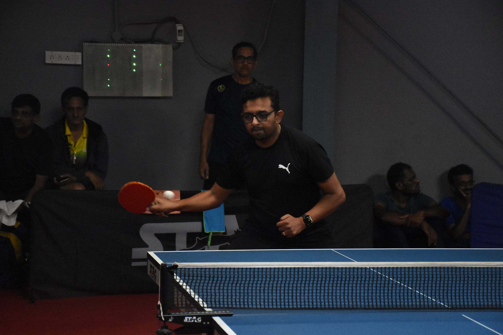

As a person, I find it difficult to stick to a fitness regime. I have tried yoga, running, cycling ([even did a 200km ride!](https://prashanth.net/completing-my-first-200km-ride-on-a-bicycle-c9b0ed4c2780)), swimming, strength training and probably more that I don’t remember anymore! Some of these things I still love and continue to get involved (maybe cycling & swimming). But none of these managed to become a habit!.

While I was thinking what interesting thing I should pickup next, it occured to me that there was one thing that stayed with for last 15 years, table tennis! I could never get bored playing it, calarie burn was just a side effect! Instead of picking up something new in my late 30s and probably suck at it, I thought why not improve on something I already know and love!

I joined [Accolades TT Academy](https://www.instagram.com/_accoladesttcentre/), which happened to be very close to my house. I quickly learnt some of the basic mistakes I was making, thanks to the great coaches there, Shreya & Gagan! But I still have a very long way to go, and that’s exciting. Accolades announced a TT tournament last week & I signed up thinking it would be a good experience.

Eventhough I have been playing for a while, I’m still a beginner from the professional stand point! I still don’t know how to read and block certain spins or to make certain spins or shots! So I had no expectation from the tournament apart from the sheer experience of it. I also had very little preparation going into the tournament as I had missed many classes due to travel & work. I did get some practice on the [Eleven](https://www.oculus.com/experiences/quest/1995434190525828/) VR, a table tennis game on Oculus Quest! It has pretty realistic graphics & amazing physics!

**Day of Tournament**

I went to the Academy on the given time slot. There seemed to be a delay in start for otherwise a very well organised tournament. I reported and just started gazing on some the ongoing games. It was filled with professional players and looking at these games made me regret signing up for the tournament! I kept watching the games while nervousness creeping inside me of getting called for my game.

The tournament was well structured to give everyone equal oppurtunity. This is one of the thing that I totally loved about the tournament, there was no age based, gender based or level based classifications. All the participants were split into random group of 4. As part of the league, each group played a round robin and top two finishers would qualify into A level and bottom two would be moved to B level. Both A & B levels then start knockouts to progress from round1 -\> pre-quarters -\> quarters -\> semis -\> final!

As expected, I lost all three games in the league. In retrospection, I feel I would have won atleast one of those if not for being nervous. I waited for the knock outs, expecting to get knocked out in the first game. Accolades had arranged for a good lunch but I couldn’t eat since I recently transitioned to Keto. In any case, I thought, I will be done there soon and have food at home.

Due to further delays in other games, knockouts started around 4 in the evening. I was waiting for callout of my name, this time without any nervousness. I had settled into the tournament environment and also I had already accepted I was going to lose and I will just give my best!

As time passed, it was time for my knockout game. Since I was not nervous and had no expectations, I thought I will try and serve with new technique I learnt through [Par Gerell Serving Masterclass](https://tabletennisdailyacademy.com/packages/par-gerell-serving-masterclass/). It was just theoritical knowledge watching videos and I had only practiced this techniqe once on Eleven VR game. But well, what’s there to lose?

I won my first knockout in two sets, opponent giving a pretty tight fight with 12–11, 12–11 in both sets. I was pretty surprised that I won and at the same time a bit taken a back since I couldn’t go home to have food! I messaged my wife that I’ll be home in a bit and keep something to eat for me. There was no way I was going though the next round, so I would be home soon!

And I won the second knockout game! Few points into the game I realised, opponent seemed nervous and making a lot of mistakes. He was also struggling to read my newly learnt serves. So I thought, I will just put the ball across and let him make the mistakes! It was best of three, I won the first and the third. He gave quite a fight by winning the second set and pushed the game to third set. And I was into quarter finals! And the hunger grows (literally in my stomach, not for TT)!

And my journey ended at quarter finals with opponent winning quite comfortably. Overall, I had a blast at the tournament and will definetely look forward for more. I also got a sense of where I stand in my game and how much more there is for me to learn. I hope Table Tennis will stay with me, a scatter brained person who keeps leaving things to go after shiny new things!

_Kudos to all organisers: Dinakar, Gagan, Shreya, Shreyas, Rakshith and team!_
