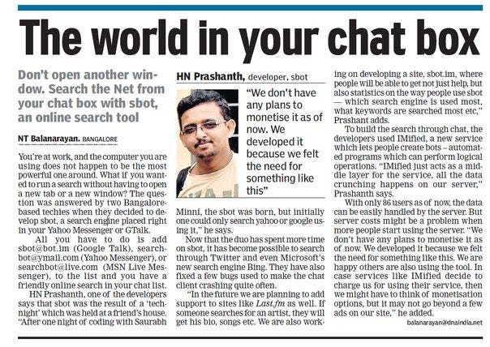
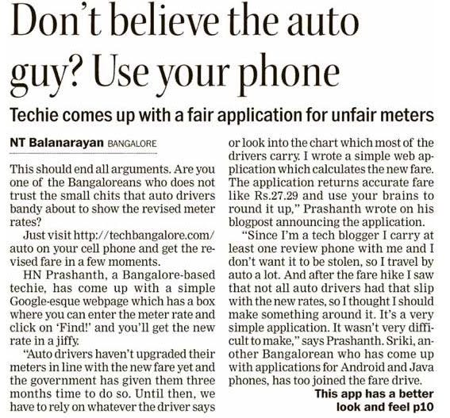
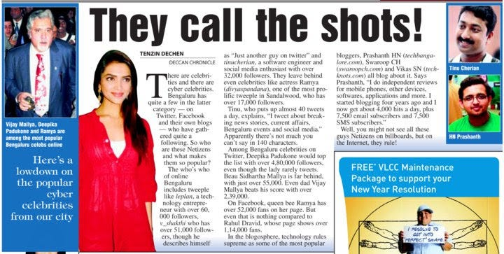
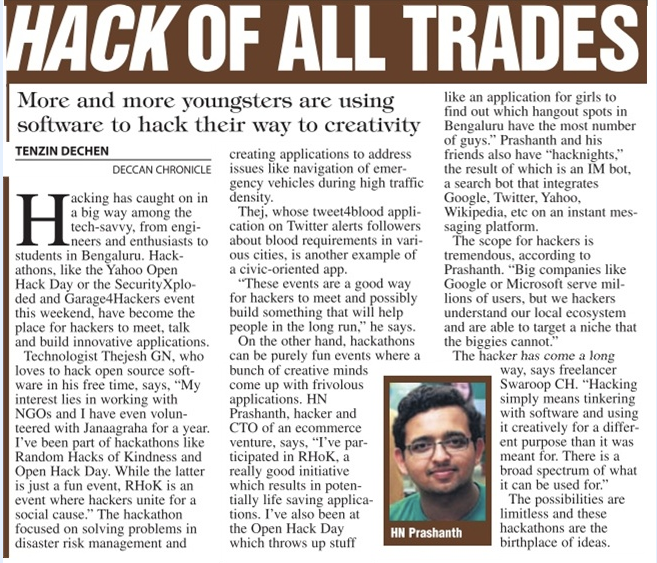
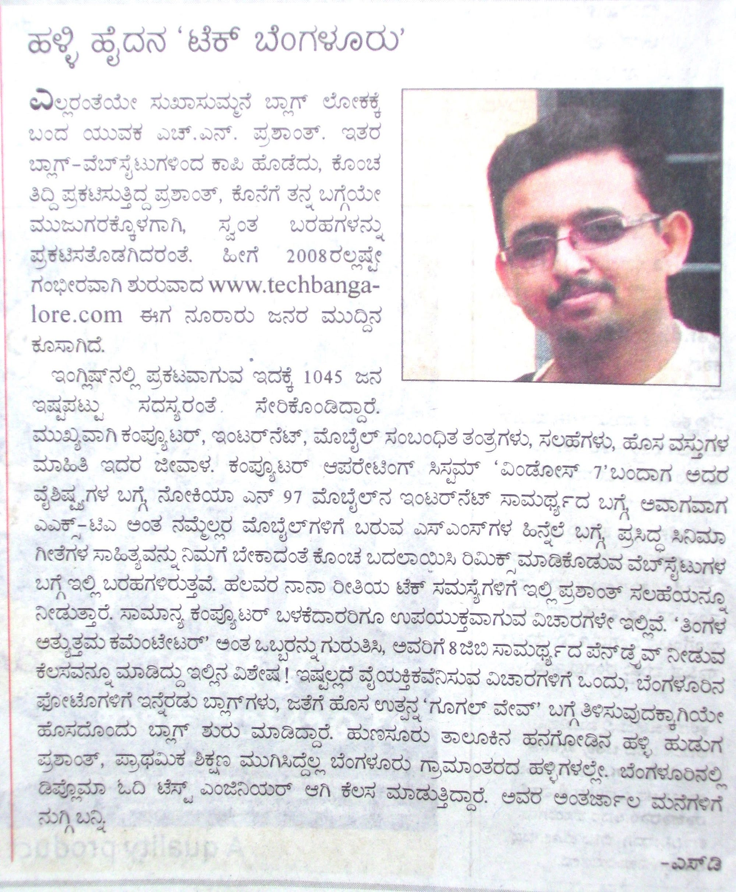

Styletag Related:

[Styletag, An Indian Fashion Site That Focuses On Emerging Designers, Scores $7.5M](https://techcrunch.com/2015/11/18/styletag-an-indian-fashion-site-that-focuses-on-emerging-designers-scores-7-5m/) — techcrunch.com

[Styletag hires Flipkart's Michael Adnani as CEO](http://www.medianama.com/2016/06/223-styletag-michael-adnani-ceo/) — www.medianama.com

[Curated fashion and lifestyle startup, Styletag.com secures Rs 50 cr angel funding from Jitu…](https://yourstory.com/2015/11/styletag-seed-funding/) — yourstory.com

Consolidation of news articles featuring me, though they are all old. thought of keeping them saved here for reference.

