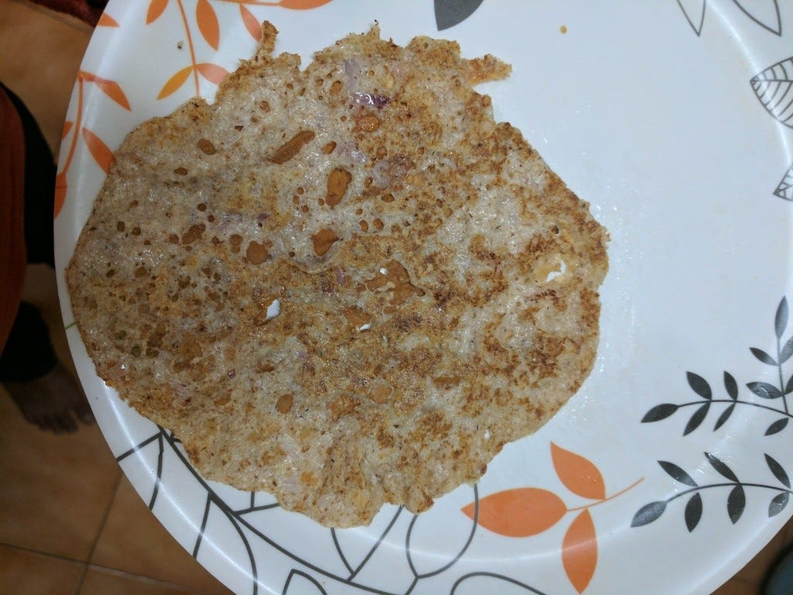
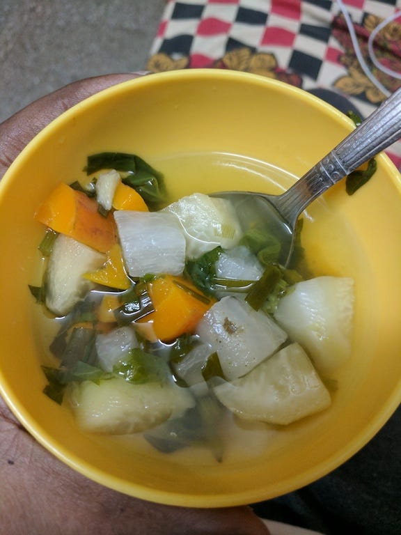
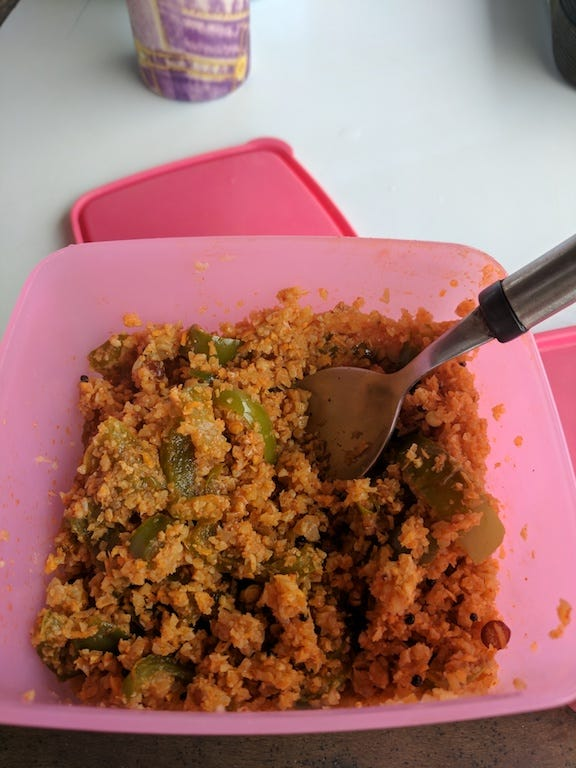
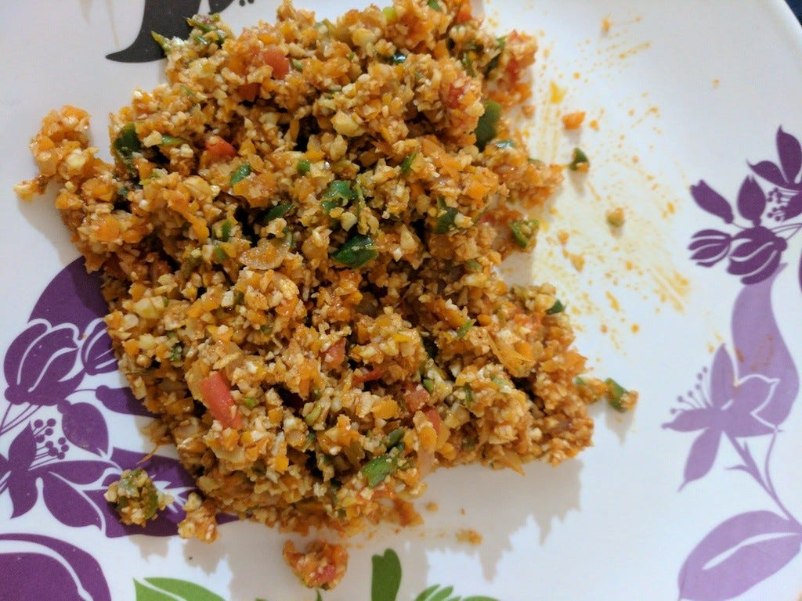
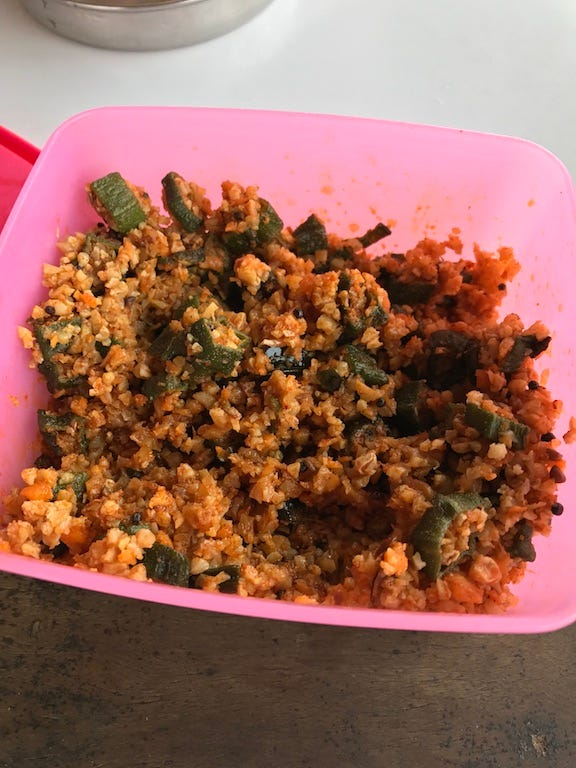

I have been on Keto for three weeks, it feels great and also getting great results. Whenever I explain Keto or LCHF to someone, the question I often get asked is “How can you just live on vegetables and nuts!?”, “Don’t you get bored of eating same thing everyday?”..etc. So I thought it’s simpler to just jot down this blog and give reference to this instead of keep repeating myself all the time!

When I started doing Keto, following were the challenges I faced:

- Online recipes mentioned lot of ingredients I didn’t have!
- Most of these recipes also assumes accessibility to some ingredients which were hard to find or too expensive.
- These couldn’t become my staple food since they were really expensive to make. Ex: a fathead pizza would approximately cost about 400 to 500 INR to make!
- Many vegetarian recipes adds egg as ingredient, which strict vegetarian like me can’t consume.

My first week was hard because of above reasons and I must blame myself that I started keto without proper planning and preparation (which I strongly suggest to anyone who is thinking to start). It took me 2–3 days to stock kitchen with all necessary ingredients and had to request my mom to give me one compartment for myself in refrigerator!

After the first week I realised that if I don’t come up with ideas to integrate Keto well into my diet, I might end up giving up. I started looking at South Indian foods I used to have before I started keto and started tweaking their recipes for Keto! Some of the foods were already Keto friendly which I started to figure out after macro calculations. Following are the foods I have successfully tweaked for keto!

- Wangi Bath, Fired Rice, Pulav, Capsicum Rice, Bendhi Rice — and many more rice based foods can be simply converted to keto by just replacing Rice with Cauliflower Rice! Replace oil with olive or coconut oil, add paneer (cottage cheese) if it goes with recipe. Don’t be conservative in using oil, that’s it.
- Most “raithas” and “mosaru bajji” are inherently keto friendly since their main ingredient is Yogurt (Indian Curd) and Cucumber!. Just limit onion and tomato in these recipes and you are good to go! This becomes a great aside for the above mentioned rice based foods!
- Kosambari’s: I used to love Kosambaris!! To make it Keto friendly I had to remove any “dal” like “urad dal”! Limit carrot, add olive oil “oggarane/tadka” (tempering). Some days I just have this as my dinner, I just love it!
- Roti/Rotti/Chapathi/Dosa: I haven’t successfully figured this out yet, this is in process, will update the post if I do.
- Upma: I like upma (most of the people I know don’t!). To make upma just make cauliflower rice finer so that it gives the texture of broken rice/wheat. Just that you can’t cook the ingredients together like a typical upma recipe, but add them to cauliflower rice once it’s cooked separately.
- Bonda/Bajji: The problem with bonda/bajji is the batter. Some veggies like Cauliflower and Bendhi (Ladies Finger) can be fried without batter and eaten with salt, pepper, chilli powder to the taste, this makes it a great evening snack. I’m still in the process of figuring out keto friendly batter (may be use curd and make something?)
- Dal: I loved dal and more than dal I used pick and eat veggies in dal! So what if I remove “dal” from dal? You get vegetable, spinach broth/soup! I find this good for dinner time! Only problem with this is limited possibility to add fat, one can add some butter and try.

Enough talk, some pictures:

