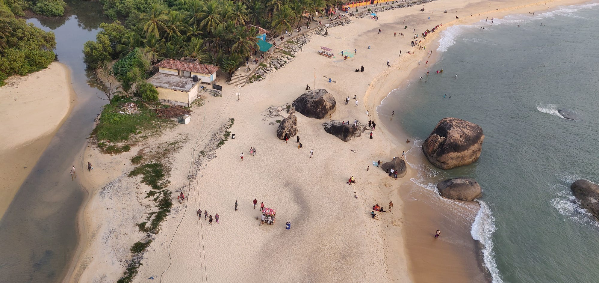

My colleagues from Karnataka’s coastal place Kundapur kept talking about their oceanic adventures! How they go with fishermen, who are their family friends. As a person who loves beaches, oceans, and open skies, their stories made me envy them! I had been to many beaches but never went into the ocean. I could only imagine what it could be like to be in the middle of the ocean! Whenever this conversation came up, I used to ask them to take me on a trip like that. We planned many times, but like a typical large group, we always had issues with dates.

## Spontaneous Plan

On a Wednesday, we spontaneously decided to finally do the much-awaited trip over the weekend with a harsh rule of “whoever comes, comes, whoever doesn’t, doesn’t”. And it worked out and most people made it to the trip. We booked a TT (Tempo Traveller) to take us from Bangalore to Kundapur! We left late night on Friday and reached Kundapur late morning on Saturday (because the driver took a break and slept off for a couple of hours!). We stayed in Hotel Sharon, which was decent, budget-friendly for the group & also had a vegetarian restaurant.

## The First Day

We didn’t have many plans for Saturday knowing that we would be tired of the travel. Non-vegetarians in the group had plans of having authentic coastal seafood. We took rest for the entire day & left the hotel to see some places. We went to see Maravanthe beach, known for the scenic sight of backwaters joining the ocean. It was quite like it was in the pictures, mesmerizing.

While I didn’t want to leave Maravanthe since it was so pleasant & peaceful, many in the group wanted to visit Kapu beach, which hosts a lighthouse. We left Maravanthe & went to Kapu beach, the journey took around 30 mins, which we nicely used to play old-school antakshari!

Kapu beach was more buzzing with stalls and a lot of people around. Lighthouse entry needed an entry ticket which we bought and went up. View from the lighthouse was very decent, but it doesn’t give you a peaceful mind to enjoy it. With people coming in & lighthouse having limited space will make you feel claustrophobic. We came down from the lighthouse and found a rock to sit on and spent some time until the sunset!

[Watch on YouTube →](https://www.youtube.com/watch?v=DNNM_oUj0BY)

## The Second Day — The Much Awaited

The second day started early with all of us getting ready for our journey into the sea. Our dear colleague Vishwas, who is from Kundapur, had requested fishermen to take us into the ocean. He had also made arrangements for the breakfast, which we packed and took along with us. We hopped into two boats and started our journey.

The boats started from backwaters which were no less scenic than the ocean and were very pleasant. Going through the backwaters reminded me of my trip to Alleppey. The boat going in backwaters was like going in Mercedes & as we approached the sea, it started reminding us of our ‘Tempo Traveller’ ride!

[Watch on YouTube →](https://www.youtube.com/watch?v=ehQ8KxjLsZQ)

Once we entered the sea, the boat was going over the waves, up & down, some people may get sickness off this! As we went in, the beach disappeared & it was jus the infinite skies and water! One could either embrace the vast openness or one could fear the water as it looked like it could consume us like it was nothing! I felt so small & powerless in front of the sea, but at the same time, it was liberating. We reached St.Mary’s island after about an hour of backwaters & sea ride. Feeling very hungry, having breakfast was the first item on everyone’s list.

We spent about one, one and a half hours at the Island, roaming around and playing in the water. Since it was getting hotter & the island started getting crowded, we left the Island & started our journey back!

**Fishing & Dolphin Sighting**

Fishermen offered us to witness fishing first hand & why would one say no to that? They started laying the net for a few hundred meters & as they went on doing it, we had a surprise awaiting. A few dolphins started coming along with us & everyone kept their eyes wide open to catch the sight of them when they came to surface! While we were all excited and jumping, the fishermen were not so happy. They called it “Handi Meenu” (Pig Fish) & told us they come to steal the fish from their nets!

**Jump, Jump, Jump……into the Ocean**

While I had swum in the ocean near the beaches, it was always on my bucket list to swim in the middle of the ocean. While we were floating around in the middle of the ocean catching fish, I asked the fisherman if I could jump out and swim a little. He asked me “do you know swimming?” and stared into my eyes as I answered “Yes” confidently, he asked again “Are you sure?”, I said “yes” again. My colleagues started panicking since many were from that place and they keep hearing horror stories about the loss of loved ones in the ocean. One guy even started pleading me not to jump!

In my head I was thinking, how often do you get this kind of opportunity? The sea was very calm, there were two boats & about 4 fishermen whom I could count on if things go bad. The fisherman in our boat gave his watch to the assistant to be ready to rescue me if I drowned! My brain was numb, not thinking anything, not giving in to what others were saying, it was fully focused on jumping and swimming (and not make a scene).

And I jumped! I went into the water for a few seconds and came out, took a breath. Another friend in the group took a leap and jumped into the sea. We swam around the boat making sure to stay close. The feeling was amazing like I was one with the ocean. If not for others panicking, I would have stayed in the water for longer.

[Recommend watching while MUTED since there is lot of screaming! Credit: Praveen Gorakala →](https://www.youtube.com/watch?v=LCN-Hb2LXsU)

Vishwas & family offered us lunch at their place which was wholesome. We all thanked them for the hospitality and left for Bangalore. This will remain as one of the memorable trips of my life.
