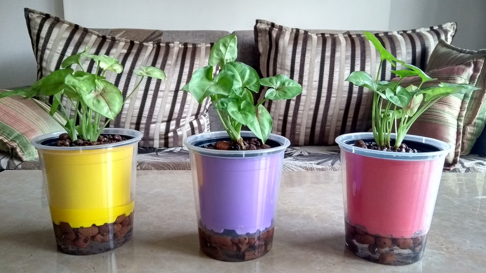
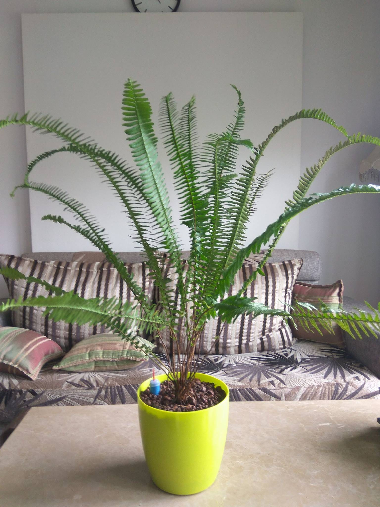
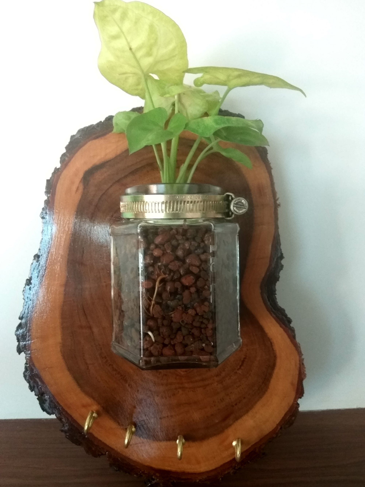

In past few years, I have tried to keep plants in my room and was never successful. I’ve wasted a lot of money buying plants and just killing them later. Most of the time it’s just watering which kills the plant, either under-watering or over-watering. It’s not easy to get right since some types of soil hold more and some hold less water. Sunlight neutralises this when outdoors, but indoors we have to get it right!

AquaGrow uses **Hydroculture** to create very pleasant environment for plants to grow in. No soil means it’s upto the plant to decide how much water it wants to take in. No soil also means easy maintenance (no more water coming out of drainage hole and messing the floor!). No fungus, no bad bacterias and no soil borne allergies. Plants grow much healthier and require less care compared to soil-grown plants.

Plants not only survive, they grow really healthy and look beautiful. This is kind of semi-autonomous system since it only requires attention once in 7–10 days. And all one needs to do is just refill the water to set level! Fertilisation is the tricky part when it comes to Hydroculture. We have simplified it to a great extent by making sprayable fertiliser, you can do this when you do water refilling.

We have priced the plants in-par with others who sell plants online, but one is getting all the benefits mentioned above. We want people to try this and experience themselves how simple it is to make plants thrive.

We have a lot more innovative products in the works which we will bring out when they are ready!

Shop our current offering at [https://aquagrow.in](https://aquagrow.in)
