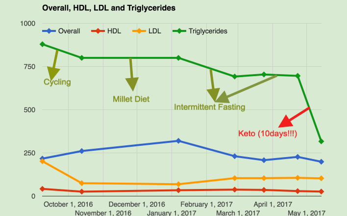

I [previously wrote](https://prashanth.net/2017/03/diets-failed-one-month-intermittent-fasting/) about my high Triglycerides and all the things I have been trying to take control of it. Unfortunately, just intermittent fasting and no change in diet could only do so much (it brought down Triglycerides level by ~100 points and then plateaued). I decided to take the next step and switched to Ketogenic diet which involves restricting net carb intake per day to less than 50grams. I will write another post about how I have integrated Keto into my life being a South Indian food lover & pure vegetarian (Update: Blog post on it here — [Integrating Keto/LCHF into South Indian Vegetarian diet](https://prashanth.net/2017/05/integrating-ketolchf-south-indian-vegetarian-diet/)).

After a week into Keto, I started feeling so great from inside and wondered if it reflects in the tests. I couldn’t resist to wait until my monthly test schedule & waited for the weekend to get myself tested. I was speechless after the result came through! This was something doctor I consulted said would take two years on meds! With no further talk, here is what it looks like:

I’m on this journey since September 2016 & you can see everything I have tried in this journey. Note that the flat line you see in the period of millet diet is because Thyrocare doesn’t give actual number in report & just says ‘above 800’. Dietary suggestion normally given to lower Triglycerides is to avoid dairy products, fats and Keto is exactly opposite of that! This gives me hope that I can get to normal range in next few months only!

**Notes on Weight Loss:**

My focus was never on weight loss, but it’s something people notice and start asking what are you up to! In last 10 days on Keto I have lost about 2 kgs. 2.5 months of Intermittent Fasting prior to Keto I had lost about 5 kgs. In last 3 months overall I have lost about 7–8 kgs.

_Disclaimer: This is my personal findings and in no way is a full fledged research, and can’t be used as a reference. Please do your own research, consult a nutrition/doctor before making changes in your diet. One research reference I can give is:_[_https://www.ncbi.nlm.nih.gov/pmc/articles/PMC2716748/_](https://www.ncbi.nlm.nih.gov/pmc/articles/PMC2716748/)
