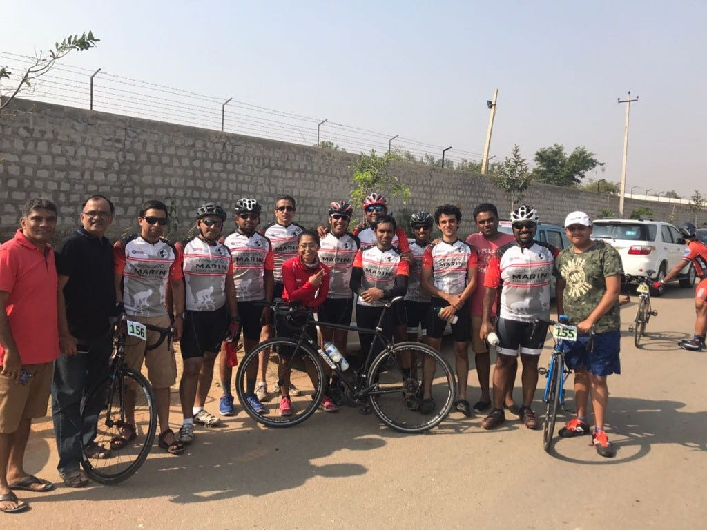

I was very skeptical about getting into racing, especially after 3–4 months of inactivity. I was in no shape physically and psychologically. With just 5–6 days to go, I was still dual minded about my participation. Looking at last year’s timings was even more demotivating :-/ Because I knew it will be bettered this year. With four days to go I thought I will do a test run and then decide and I managed to finish it with 1.0.8.XX. After finishing that I felt I could push more since I was not fatigued. That gave me some confidence to just go try my leg at it and don’t bother about the outcome. Also, all thanks to Team Cadence90 who always talk positive and motivate others in team.

**Race Day:**

We reached the venue fairly early so that there’s enough time to get ready and warmup. BBCh was flawless in organising it, at least for the part I was present there. I had to return early to attend a family function (missed opportunity to meet so many awesome people). We were given our bibs, a transponder to track time and a YogaBar(sponsor). They had also arranged bananas & sandwiches (for breakfast). BBCh had created a start list a day before and everyone were communicated through SMS. They started on time skipping those who didn’t make it to the race.

Individual Time Trial is basically you vs clock, also known as “race of truth” since there is no support from team members. BBCh ITT was about 33.5km stretch where we had to take u-turn at half way point. I started steady and calm and settled in to a rhythm. I felt good and started upping my speed a bit and to my surprise my average speed was at 32kmph at half way point! I thought, if that’s the case, I can try finish as closely as possible to 1 hour mark. But, post u-turn, I started to slow down, thanks to headwinds, it became pretty hard to maintain the desired average speed. I had to face the reality and preserve myself to push last few kilometers. I finished strong with 1:06:00 minutes showing on my Garmin but the official timing was 1:06:07.

Timings aside, that feeling of finishing the race strong felt really awesome to me. It would have been a huge mistake if I had shied away from participating thinking I’m not there yet. So my message to people questioning themselves whether they are ready,**just get there, experience it & it will motivate you to do better next time**.

A big thanks to BBCh for making this happen, being amateur friendly and sticking to the rules/timings with flawless execution. Race results can be found here: [http://bbch.in/BBCh17Race02.htm#BBCh17\_02\_ITTResult](http://bbch.in/BBCh17Race02.htm#BBCh17_02_ITTResult)
