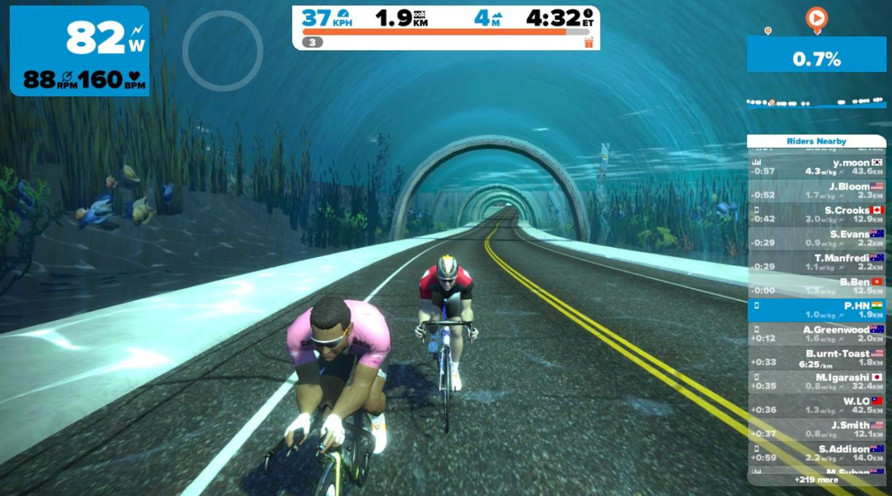

Zwift is a Game but your performance isn’t dependent on how fast you can move the mouse or click the buttons! Zwift is a virtual world for cyclists (coming for runners soon) where they can take a spin at the comfort of an indoor trainer! Since going out for cycling through weekdays was becoming hard for me, I started looking to get an indoor trainer. Another reason was that, I almost never could follow training instructions while out on road.

**Kinetic Road Machine: Short review**

I was initially looking for a smart trainer, but their availability in India is nil. Smart Trainers have interface for apps like Zwift, TrainerRoad to automatically adjust resistance. So, when you hit a climb in Zwift, it automatically gets harder for you to pedal! Asking someone(from US) to get it for me wasn’t an option because it would weigh around 20kgs! So I picked up the best indoor trainer available over here, Kinetic Road Machine. I had to also buy a small device called “Kinetic inRide” which kind of makes this trainer semi smart by streaming power over bluetooth. Zwift can still calculate “virtual power” if inRide is not present but that would require speed & cadence sensors (Ahh this is getting too technical!). I have been using this trainer for a month now and I’m really happy about it. I’m glad that I didn’t buy a smart trainer, cost difference wouldn’t make up for auto-resistance adjustments. Plus the hassle of importing and not having warranty.

**Why iPad instead of a display?**

Most Zwift users use their laptop and hook it to a big display/TV, which is something I tried the first time. But using living room TV whenever I desire wasn’t an option since my parents would be watching some or the other program. There was no space in room to accommodate trainer and use my display. I tried to use iPad, and it was actually pretty good. Having the screen right in front of me allowed me to have better readability/visibility and also intractability! Though a big display would give a better experience comparatively, it wasn’t much of a compromise with iPad.

**Wahoo Tickr**: Read my full review here [Wahoo Tickr Heart Rate Monitor Review Using With Strava](/posts/wahoo-tickr-heart-rate-monitor-review-using-with-strava)

**Video of my setup:**

[https://www.youtube.com/watch?v=kv0Ef6cTG2o](https://www.youtube.com/watch?v=kv0Ef6cTG2o)

_Indoor trainer was bought at_[_Cadence90.in_](http://cadence90.in/)_(Disclaimer: owner is a good friend & I race for this team)_

Overall, my consistency of being active has increased since having an indoor trainer. Whenever I feel like spinning I can just hop on and do a 10k ride in Zwift! Otherwise, my timing was only limited to morning 6 to 8, beyond that traffic would increase and make it not so fun to ride. I quit gaming few years ago for having negative impact on my life, but this is a good addiction to have for a change!
