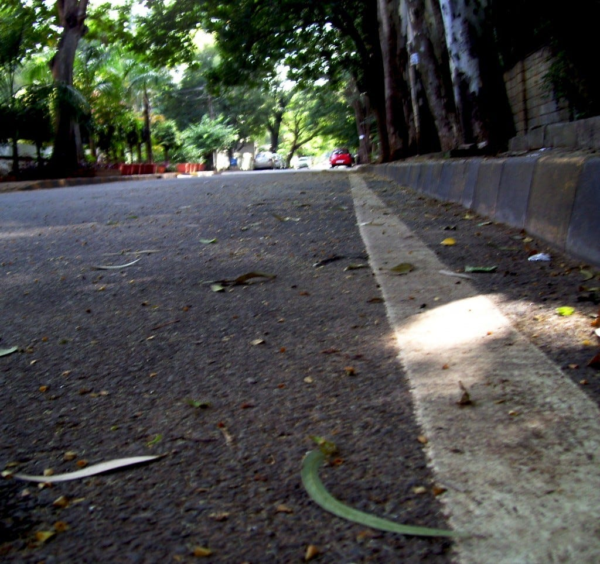

Im turning 26 today and suddenly it feels like life is getting more serious!

I recently deleted my personal blog & all the posts in it. Looking back at them gave me the feel of satisfaction & saturation. When I look back at 2009, it was the funnest year I ever had in my life. There was nothing to worry about, whatever I do people used to talk about it, even the worst dance ever in lungi! I dont like it when everything settles down & there are no challenges in life :P

Year 2010, the year which brought lot of changes to my life. I quit my first job which I worked for 4.5 years, joined web startup Gizapage. Before I complete my 6 months over there, I quit that job too, urging to do something on my own. Lot of ideas came to my mind & went after validating them with some friends. Finally settled down with an idea & is now a stealth startup. I cant talk about it much now, I will when the time comes.

**Being on my own**

Entrepreneurship isnt as fancy as it looks like. Its been 5 months since Im out of job and its really hard to be in this position. Its hard to live the life without a monthly income which you are already used to. Starting something on your own right after the college is best AFAIK. After all the possible cost cutting, I was out of money every month. Tech Bangalore is a life savior, without it I couldnt have survived so far.

Being on your own means a lot of pressure, stress on mind. Our society isnt matured enough to support Entrepreneurship. Most of them want you to fail, because you are trying to stand out of crowd & they are the crowd. They find their happiness in good job, good salary, a house, a car which can bring them a good wife! But there are also lot of friends & cousins who say Whatever you do, it will be a success which brings back the confidence in me.

Here I am now, forgetting all that happened to me so far & starting from scratch again. New life, new challenges, more older!! Wish me luck :-)
