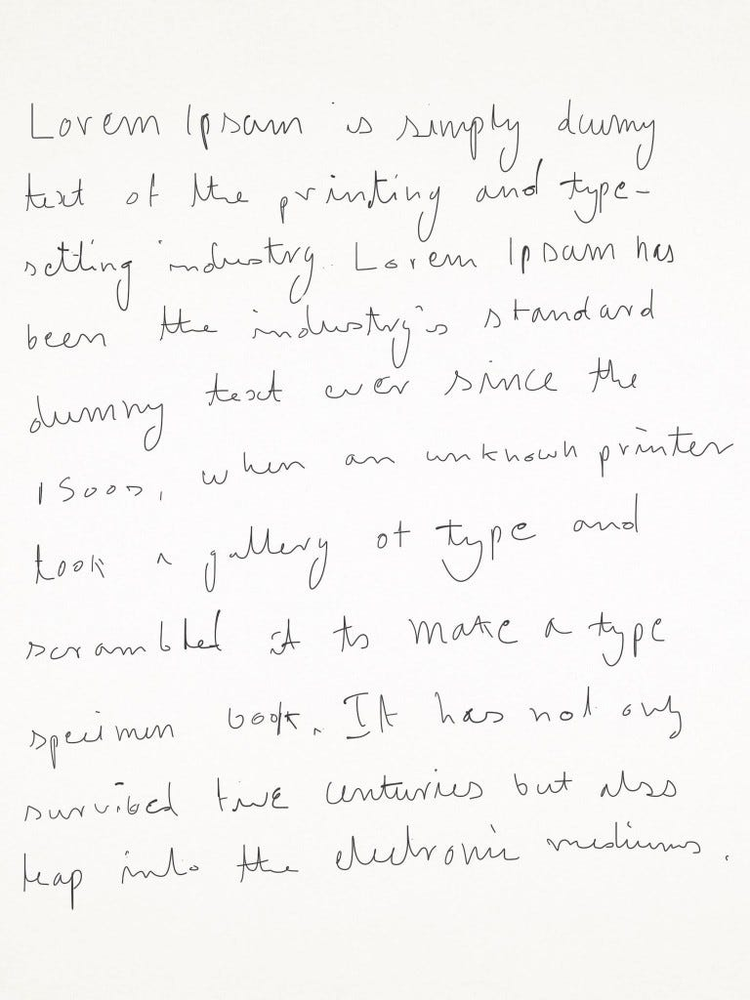

With lot of meetings to attend, my notes started getting cluttered and I started loosing some. That’s when I started looking for a digital solution which is as close as possible to normal note taking. Through my initial searches I landed on [Wacom Bamboo Spark Notepad](https://www.amazon.in/gp/product/B010PKT6C2/ref=as_li_tl?ie=UTF8&camp=3638&creative=24630&creativeASIN=B010PKT6C2&linkCode=as2&tag=prashanthnet-21&linkId=be90b210c3487d352d6fa15e78b4e9a4). It didn’t make sense for me to put so much money into a notepad. Then I realised that I have an iPad (iPad Mini 2) and started to explore note taking on iPad. Having an iPad was better in meetings since I could also use that to browse and do other research while in the meeting.

With my hunt for note apps on iPad which have good palm rejection, I ended up with GoodNotes. I ordered a [normal touch screen stylus](https://www.amazon.in/gp/product/B017ESQBGW/ref=as_li_tl?ie=UTF8&camp=3638&creative=24630&creativeASIN=B017ESQBGW&linkCode=as2&tag=prashanthnet-21&linkId=9b994191ac27144fb93b5f9b4e587308) on amazon to use with this app. Though it gave a decent palm rejection with “palm rest” feature, it was far from making taking notes natural. With further research, I ended up with [Wacom Bamboo Fineline](https://www.amazon.in/gp/product/B014P0CN78/ref=as_li_qf_sp_asin_il_tl?ie=UTF8&tag=prashanthnet-21&camp=3638&creative=24630&linkCode=as2&creativeASIN=B014P0CN78&linkId=ffd310dc17196d739ee1a4ce3ff4375d) active stylus series. There were other bluetooth active styluses (like Pencil by 53), but the finiline had a thin tip which made it perfect for taking notes/writing. [Pencil by 53](https://www.amazon.in/gp/product/B00SIYUBMC/ref=as_li_qf_sp_asin_il_tl?ie=UTF8&tag=prashanthnet-21&camp=3638&creative=24630&linkCode=as2&creativeASIN=B00SIYUBMC&linkId=765aea5ea0031b68d4f2a4a16a301b76) would be better option if the usage is more towards art/sketching.

Bamboo Fineline just feels very natural, so much so that you would switch from iPad to paper and try to write! Since it’s an active stylus, palm rejection is perfect. When the Bamboo Fineline is connected, iPad stop taking input from you fingers and palm which makes it perfect. Though this feature is not supported by all the applications, list of applications which support these features is available on Wacom website. Bamboo Fineline also has pressure sensitivity, which was not really important for me since I was just looking to write with it.

Overall, it feels great in hand like a normal pen and palm rejection makes it a great iPad companion for someone who takes notes, scribbles or into sketching/art.

Here is the sample scribble I had done using Bamboo Fineline 2 (pardon my handwriting, it actually looks better here):

Amazon — [http://amzn.to/2jKNzKd](http://amzn.to/2jKNzKd)
