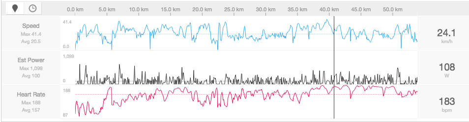
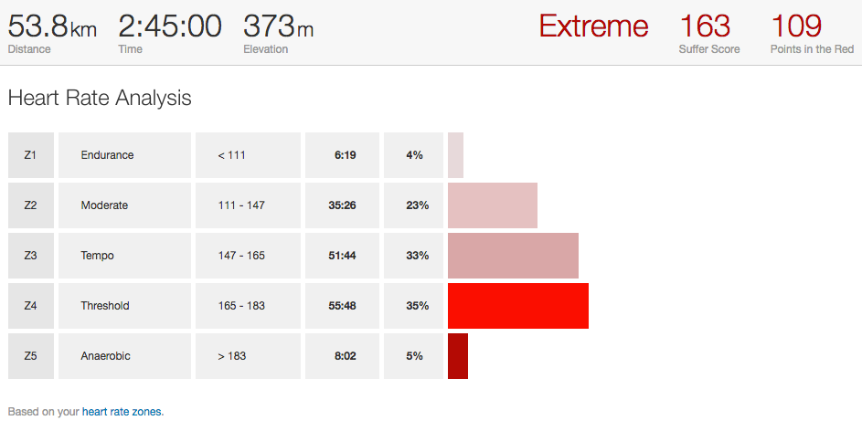

I started Cycling couple of months ago and always wondered whether I’m pushing my limits or taking it easy. I quickly learnt that measuring Heart Rate will intern measure the intensity of workouts. Being a newbie Cyclist, I love Strava and hence I started looking for Heart Rate Monitors (HRM) which work well with Strava. Strava’s store had Wahoo and seemed like they recommend Wahoo Tickr.

Wahoo Tickr is a chest strap HRM and generally chest strap HRMs are more accurate than optical sensors which comes in watches and some phones. Tickr is pretty straight forward to use, just adjust the strap length to comfortably cover your chest and put it on. As soon as you put it on, it starts detecting the pulse as well as starts bluetooth discoverability, I opened Strava on my Android phone, opened “Record Activity” screen and tapped on sensor icon & in couple of seconds it appeared. I just had to tap “Add” and my Heart Rate was already streaming.

**Using it with Strava**

Strava does real-time recording of Heart Rate streamed by the Tickr. When you are Cycling it shows present Heart Rate on your phone screen so that you know how much effort you are putting in. Once the activity is finished you can access HR in the analysis of your ride.

Using this analysis you will know your limits and start working towards improvising. One must calculate their Max Heart Rate to make more sense of this. There are multiple formulas (Tip: Google for “Max HR formula”) to calculate Max HR. Simplest (but may not be most accurate) formula being 220 — Age. So if you are 28 years old your Max HR would be 220–28 which is 192. You can learn more about Max HR by Googling since it is out of context in this article I’m not going to talk more about it here.

**Strava Suffer Score (Premium Only)**

Once you calculate Max HR, you need to feed it into Strava in “Settings -\> My Performance”. Based on Max HR Strava will create Heart Rate Zones. Post activity Strava analyses how much time you were in different HR zones and calculates “Suffer Score”.

Next time you plan a long ride, you know which zone you need to stay in to keep going. The more fitter one becomes the less effort it would take to do same workout/ride. Overall Wahoo Tickr is very simple to use and works very well with Strava.

[Buy Wahoo Tickr on Amazon.in](https://www.amazon.in/Wahoo-TICKR-Monitor-iPhone-Android/dp/B00INQVYZ8/ref=as_sl_pc_tf_mfw?&linkCode=wey&tag=prashanthnet-21)

P.S: If you follow Tour De France, you can see Team SKY riders using Wahoo Tickr!!
